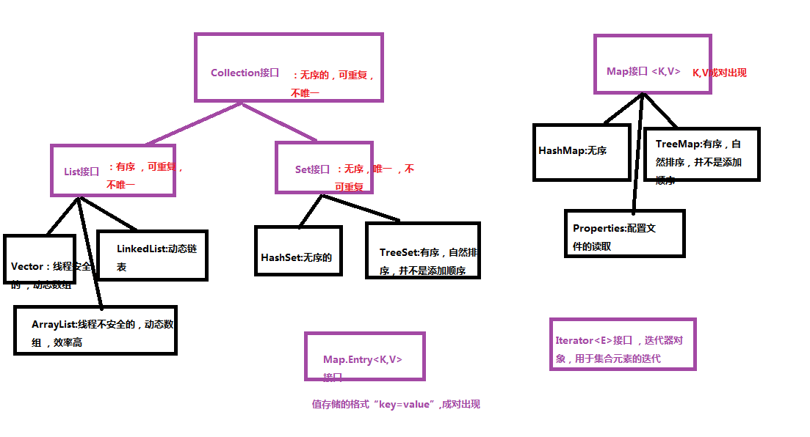

# Java

# String

* String和StringBuffer，StringBuilder的区别？

  > 1. 都是final类，都不允许被继承；
  > 2. String类长度是不可变的，StringBuffer和StringBuilder类长度是可以改变的；
  > 3. StringBuffer类是线程安全的，StringBuilder不是线程安全的；
  > - **String和StringBuffer**：
  > 1. String类型和StringBuffer类型的主要性能区别：String是不可变对象，每次修改都会 生成新的string	对象，然后将指针指向新的对象。故如果经常修改字符串的长度不要使用String这样会对系统性能产生影响
  > 2. 使用StringBuffer类时，每次都是对StringBuffer对象本身操作。而不是生成新的对象并改变，所以推	荐使用StringBuffer类，特别是在对字符串操作频繁的情况下。
  > - **StringBuilder**
  > StringBuilder是5.0新增的， 此类提供一个与StringBuffer兼容的API，但是不保证同步。
  > 	该类被设计作为StringBuffer的简易替换。用在字符串缓冲区被单个线程使用的时候。如果可能，简易优先采用该类，因为在大多数现实中，它比StringBuffer要快。
  > 
  > - **使用策略**：
  > 1. 基本原则：如果要操作少量的数据，用String；单线程操作大量数据，用StringBuffer；多线程操作大量数据，用StringBuffer
# 面向对象

## 封装

### 什么是封装

封装是吧类中的属性私有化，并提供公共的方法来返回属性的值，如果想从外部修改这些属性，只能通过公共的方法，而无法直接访问属性。类中的属性被隐藏，所以封装也称为数据的隐藏。

### 封装的步骤

1. 将属性私有化（private）
2. 编写set和get方法（set，get访问器）

*装箱*
```java

package com.yunsi.baozhuang.d0318;
/**
 * 装箱
 * 基本数据类型---》包装类
 * @author Administrator
 *
 */
public class Test01 {
	public static void main(String[] args) {
		//int--->Integer
		int num1=10;
		Integer num2 = new Integer(num1);
		
		//String--->Integer
		String s="10"; 
		Integer num3 = new Integer(s);
		
		//double--->Double
		double num4 = 2.3;
		Double num5 = new Double(num4);
		
		//String-->Double
		String s2="2.3";
		Double num6 = new Double(s2);
		
		//char--->Character
		char zifu='a';
		Character zifu2 = new Character(zifu);
		
		//不支持
//		String s3="a";
//		Character zifu3 = new Character(s3);
		System.out.println("-----------------------------");
		//int--->Integer
		Integer num7 = Integer.valueOf(num1);
		
		//String--->Integer
		Integer num8 = Integer.valueOf(s);
		//Integer.valueOf("10",2); 
		Integer num9 = Integer.valueOf(s, 2);
		System.out.println("num9="+num9);  //2
		
		Integer num10 = Integer.valueOf("111", 2);
		System.out.println("num10="+num10); //7
		
		Integer num11 = Integer.valueOf("111", 8);
		System.out.println("num11="+num11);//73
	}
}
```

*拆箱*

```java

package com.yunsi.baozhuang.d0318;

/**
 * 拆箱
 * 包装类----》基本数据类型
 * @author Administrator
 *
 */
public class Test02 {
	public static void main(String[] args) {
		//Integer---》int
		Integer num1 = new Integer(10);
		int num2 = num1.intValue();
		
		//Double--->double
		Double num3 = new Double(10.23);
		double num4 = num3.doubleValue();
		
		//Character--->char
		Character zifu = new Character('a');
		char zifu2 = zifu.charValue();
		
		//String--->int
		String s="123";
		int num5=Integer.parseInt(s);
		
		//String--->double 
		String s2="1.23";
		double num6 = Double.parseDouble(s2);
		
		//" java.lang.NumberFormatException: 数据格式异常 
		String s3="123abc";
		int num7=Integer.parseInt(s3);
	}
}
```

##### 封装的好处

- 类的属性可对外只读或只写（读与写的权限两者不能同时获得，每次调用一个方法只能有一种全权限）
- 类可以完全控制自己的属性（因为set和get访问器由提供，所有类中的属性的控制权在于类而不是对象）
- 类可以修改属性的数据类型，而不会影响外部调用（对象只负责通过set，get方法调用类的属性，在set，get方法未被删除的情况下，属性类型的改变不会影响对象的调用）

#### 总结：

- 使用封装使类中的属性与外界分离，使代码结构更为清晰
- 由于外界对类属性的调用做了一定限制，提高了代码的安全性

## 继承
## 1.什么是继承

继承是从已有的类中派生出新的类，新的类能够吸收已有的类的属性和方法，并能派生出新的属性和方法。

### 2.继承的实现

 只能继承public和protected修饰的，不管在不在同一包里
 继承默认(default) 修饰的，只能在同一个包里
 构造方法不能继承。只能调用，通过super调用。

1. 使用super关键字，super代表父类对象；
2. 在子类构造方法中调用且必须是第一句；
3. 不可以访问父类中定义为private的属性和方法。 

继承父类的属性：
```java
	super();	//访问无参构造
	super(@参数); //访问带参构造
	super.@属性名; //访问父类的属性
	this.@属性名; //当子类中没有这个属性时，this就访问父类的这个属性
```

继承父类的方法：
```java
	super.@方法名();
```
### 3.继承下构造方法的执行过程

	执行顺序：父类静态成员 -> 父类静态代码块 -> 子类静态成员 -> 子类静态代码块 -> 父类实例成员，普通代码块 -> 父类构造函数 -> 子类实例成员，普通代码块 -> 子类构造函数

### 4.方法重写（重点）

 1. 方法名相同
 2. 参数列表相同
 3. 返回值类型相同或者是其子类
 4. 子类重写的时候访问权限不能严于父类(访问权限比父类要松）或者访问级别>=父类 
 *   严格程度从大到小排序   private> default> protected>public
 *   访问级别排序：  public>protected>default>private
 5. 父类的静态方法不能被子类覆盖为非静态方法，父类的非静态方法不能被子类覆盖为静态方法
 *   如果父类有静态方法，子类也有同名的静态方法，这个不叫重写，只是方法同名而已
 *   重写只针对普通方法，跟静态方法无关。  
 6. 子类可以定义与父类同名的静态方法，以便在子类中隐藏父类的静态方法。
 *   如果子类没有和父类同名的静态方法，子类Sub.ceshi5()调用的就是父类的静态方法 
 *   如果子类Sub中，有和父类同名的静态方法，子类Sub.ceshi5()调用的就是子类自身的静态方法
 7. 父类的私有方法，只能父类自己使用，子类无法访问

**重写和重载的区别？（重点）**

* 方法的重写：父子类，方法同名，同参，返回值相同或是其子类，访问权限不能严于父类的方法权限。

* 方法的重载：同一个类，方法同名，参数列表不同（个数，类型，顺序），和返回值、访问权限无关。

## 多态

### 1. 什么叫多态

* 多态是同一个行为具有多个不同表现形式或形态的能力。
* 多态就是同一个接口，使用不同的实例而执行不同操作

### 多态的实现方式

##### 方式一：重写

	参见 继承 -> 4.方法重写

##### 方式二：接口

1. 生活中的接口最具代表性的就是插座，例如一个三接头的插头都能接在三孔插座中，因为这个是每个国家都有各自规定的接口规则，有可能到国外就不行，那是因为国外自己定义的接口类型。

2. java中的接口类似于生活中的接口，就是一些方法特征的集合，但没有方法的实现。具体可以看 java接口 这一章节的内容。

##### 方式三：抽象类和抽象方法

###### 抽象类和抽象方法
**抽象类**

拥有抽象方法的类就是抽象类（但抽象类中也可以不包含抽象方法），抽象类要使用abstract关键字声明。

1. 抽象方法必须定义在抽象类中，反过来，抽象类类不一定有抽象方法
2. 抽象类可以拥有普通类所拥有的一切成员（普通变量，静态变量，静态代码块，普通代码块，构造，内部类，普通方法，静态方法） ，还能拥有抽象方法
3. 抽象类不能实例化（不能new)
4. 抽象方法必须在子类中被实现，除非子类是抽象类
      	

### 3. 多态存在的三个必要条件

1. 要有继承
2. 要有方法的重写
3. 父类引用指向子类对象 向上转型

### 4. 多态的优点

1. 消除类型之间的耦合关系
2. 可替换性
3. 可扩充性
4. 接口性
5. 灵活性
6. 简化性

### instanceof关键字

* instanceof 是 Java 的一个二元操作符，类似于 ==，>，< 等操作符。
* instanceof 是 Java 的保留关键字。它的作用是测试它左边的对象是否是它右边的类的实例，返回 boolean 的数据类型。

*注意：使用 instanceof 时，对象的类型必须和 instanceof 后面的参数所指定的类在继承上有上下级关系*

# 接口

**对抽象类和接口的区别的理解**

1. 能够包含的元素上（不同的地方）
   抽象类可以存储普通类拥有的一切成员（普通变量，静态变量，静态代码块，普通代码块，构造，内部类，普通方法）+抽象方法必须在子类中被实现，除非子类是抽象类
   接口：只能存储全局的静态变量+全局的抽象方法，其他任何内容都不存储。
2. 抽象类不能实例化，接口也不能实例化。（相同点）
3. 抽象类中的抽象方法，必须被子类重写~~实现~~，除非子类也是一个抽象类
   接口中的抽象方法吗，必须被实现类实现，除非这个类也是抽象类（相同的地方）
4. 1个类只能继承一个抽象父类，但是1个类可以实现多个接口（不同的地方）
5. 抽象类，只能有1个直接父类，java中只支持单根继承
   接口，可以有多个父类，1个接口可以继承自多个父接口，支持多继承
   一个接口不能实现另一个接口，但可以继承多个其他接口（不同的地方）

## 接口的优点:

* 接口有比抽象更好的特性
* 可以被多继承
* 设计和实现完全分离
* 更自然的使用多态
* 更容易的搭建程序框架
* 更容易更换实现
* 接口是一种约定：有些接口只有名称（Serilizable接口）
* 面向接口编程：程序设计时，面向接口的约定，而不考虑具体实现
* 接口中的成员变量，默认都是public static final的，必须显式初始化
* 接口中的方法，默认都是public abstract的
* 接口没有构造方法，不能被实例化
* 一个接口不能实现另一个接口，但可以继承多个其他接口
* 一个类必须实现接口的全部抽象方法，除非这个类也是抽象类

# 正则表达式

#### 元字符

```markdown
.通配符
^
$
*  匹配前面的子表达式零次或多次。例如，zo* 能匹配 "z" 以及 "zoo"。* 等价于{0,}。
+  匹配前面的子表达式一次或多次。例如，'zo+'能匹配"zo"以及"zoo"，但不能匹配 "z"。+ 等价于 {1,}。
?  匹配前面的子表达式零次或一次。例如，"do(es)?"可以匹配 "do"、"does"中的"does"、"doxy"中的 "do"。?等价于{0,1}。
{}  限定符  限定符用来指定正则表达式的一个给定组件必须要出现多少次才能满足匹配
[]
\
()
|
```

# 异常处理

* 所有的异常类是从java.lang.Exception类继承的子类。
* Exception 类是Throwable 类的子类；
> Throwable有两个子类，一个是Error类，另一个是Exception类
> Error中的错误是程序员不能处理的运行环境错误，如jvm虚拟机内存溢出崩溃，等严重错误
> Exception是能程序员捕并处理的异常
* Exception类中包含两类异常：
	RuntimeException 类，属于unchecked异常
	Exception 类 和 Throws 类，属于 checked异常

## 1. 处理异常

* try 块：用于捕获异常其后可接多个catch块。如果没有catch块，则必须跟一个finally块。
* catch 块：用于处理try捕获的异常
* finally 块：无论是否捕获或处理异常，finally块里的语句都会被执行。
* 在如下四种情况下，finally块不会执行：
    1. 在finally 语句块中发生了异常。
    2. 在前面的代码中用了System.exit()。
    3. 程序所在的线程死亡。
    4. 关闭CPU。

**注意：try-catch块中存在return语句，finally块还会执行。执行顺序：先执行try，如果有异常执行catch然后执行至return前一句后跳至finally执行，待finally执行完了后跳回执行return。**

## 2. 使用throws声明并抛出异常

声明格式：

```java
	方法名throws 异常1,异常2...
```

**注意：处理异常的两种方式**
1. 方式一：调用者处理异常，即用try-catch来处理
2. 方式二：调用者继续抛出异常(main()方法声明的异常由java虚拟机来处理) \
	使用throws关键字将异常抛给调用者后，如果调用者不想处理该异常，可以继续向上抛出。但最终要有能够处理该异常的调用者。

代码一：
```java

package com.yunsi.exception02;

import java.text.DateFormat;
import java.text.ParseException;
import java.text.SimpleDateFormat;
import java.util.Date;

/**
 * throws 抛出异常 ， 方法本身没有处理异常，将异常上抛，给调用者去处理 
 * 
 * 对于调用者，有可能处理 try-catch-finaly 
 *         有可能不处理，  继续上抛  继续throws抛出 
 * 如果调用者，一直不处理 ，最终调用者main() ,这个时候，异常由jvm来处理。 
 * 访问修饰符  返回值类型 方法名（参数列表） throws 异常1，异常2，....{
 * 
 * }
 * @author Administrator
 *
 */
public class Test01 {

	/**
	 * 抛出可查异常 ParseException
	 * @throws ParseException
	 */
	public void parseTime() throws ParseException{
		String s="2012-3afaf-3";
		DateFormat df = new SimpleDateFormat("yyyy-MM-dd");
		Date date=df.parse(s);
	}
	
	/**
	 * 对parseTime()方法，抛出的异常 ， diaoYongFirst（）选择继续上抛
	 * @throws ParseException
	 */
	public void diaoYongFirst() throws ParseException{
		parseTime();
	}
	
	
	/**
	 * 对parseTime()方法，抛出的异常 ，diaoYongSecond()选择自己处理掉
	 */
	public void diaoYongSecond(){
		try {
			parseTime();
		} catch (ParseException e) {
			e.printStackTrace();
		}
	}
}
```

代码二：
```java
package com.yunsi.exception02;

import java.text.ParseException;

/**
 * java.text.ParseException: Unparseable date: "2012-3afaf-3"
	at java.text.DateFormat.parse(DateFormat.java:337)
	at com.yunsi.exception02.Test01.parseTime(Test01.java:29)
	at com.yunsi.exception02.Test01.diaoYongFirst(Test01.java:37)
	at com.yunsi.exception02.Test01App2.main(Test01App2.java:16)

分析异常的栈信息： 从下往上看，最下面一行：是调用的地方，发生异常的语句  ，最上面一行：离异常最近的地方
 * @author Administrator
 *
 */
public class Test01App {
	/**
	 * main()作为最后一级调用者，也没有处理异常，选择的继续上抛，最终如果发生异常由 JVM处理
	 * 消极的处理方式
	 * @param args
	 * @throws ParseException
	 */
	public static void main(String[] args) throws ParseException {
		Test01 te = new Test01();
		//调用方法
		te.diaoYongFirst();
		System.out.println("*********异常处理之后的代码不能执行************");
	}
}
```

代码三
```
package com.yunsi.exception02;

public class Test01App3 {
	/**
	 * main作为最后一级调用者，调用了 diaoYongSecond()， 
	 *  而这个方法diaoYongSecond()本身内部进行了try-catch处理 
	 *  所以main无需处理，直接使用就行了
	 * @param args
	 */
	public static void main(String[] args) {
		Test01 te = new Test01();
		te.diaoYongSecond();
		
		System.out.println("************异常之后的代码可以执行****************");
	}
}

```

代码四：
```java
package com.yunsi.exception02;

import java.io.FileNotFoundException;
import java.text.ParseException;

public class Test02 {

	/**
	 * 显示的抛出2个异常
	 * @throws ParseException
	 * @throws FileNotFoundException
	 */
	public void ceshi()  throws ParseException,FileNotFoundException{
		System.out.println("---------Test02.ceshi()-------------");
	}
	
	
	/**
	 * 抛出的异常个数，要和捕获的catch数量一致
	 */
	public void diaoYongFirst(){
		try {
			ceshi();
		} catch (FileNotFoundException e) {
			e.printStackTrace();
		} catch (ParseException e) {
			e.printStackTrace();
		}
	}
	
	
	/**
	 * 继续上抛的，异常个数，也要和原始方法中异常抛出的个数一致
	 * @throws FileNotFoundException
	 * @throws ParseException
	 */
	public void diaoYongSecond() throws FileNotFoundException,ParseException{
		ceshi();
	}
	
	
	/**
	 * 如果抛出的是父类异常Exception, 覆盖掉所有的子类异常，也是可以的
	 * @throws Exception
	 */
	public void diaoYongThird() throws Exception{
		ceshi();
	}
}
```

代码五：
```java
package com.yunsi.exception02;

public class Test03 {
	public void ceshi() throws NullPointerException,StringIndexOutOfBoundsException{
		System.out.println("----------Test03.ceshi()中抛出了2个不可查异常-------------------");
	}
	
	
	/**
	 *  ceshi()抛出2个不可查异常，编译器检测不到，所以没捕获，没继续上抛，也不会报错
	 */
	public void diaoYongFirst(){
		ceshi();
	}

	/**
	 * 因为ceshi()抛出的是不可查异常，本方法 diaoYongSecond()抛出错误的异常，编译器也检测不到 
	 * @throws NullPointerException
	 * @throws ArrayIndexOutOfBoundsException
	 */
	public void diaoYongSecond() throws NullPointerException,ArrayIndexOutOfBoundsException{
		ceshi();
	}
}
```


*使用throw抛出异常*
格式(需要独立成一行语句，且需要用"throws 异常类的名称"声明)：
```java
	throw new 异常类的名称
```

### 3. 自定义异常


自定义异常步骤：
1. 定义异常类(继承 Throwable 类，Exception类 RuntimeException)
2. 编写构造方法，继承父类的实现
3. 实例化自定义异常对象
4. 使用throw 抛出

示例代码一

```java
package com.yunsi.exception04;

//@SuppressWarnings("serial")
public class IllegalAgeException extends Exception{
	private static final long serialVersionUID = 369902796174092820L;

	public IllegalAgeException(String message) {
		super(message);  //调用父类Exception的带参构造
	 }
	
}

```


示例代码二

```java
package com.yunsi.exception05;

public class IllegalAgeException extends Exception{
	private static final long serialVersionUID = 393878154469874217L;
	private String errorCode; //错误码
	private String errorMsg; //错误消息  
	
	
	public String getErrorCode() {
		return errorCode;
	}
	public void setErrorCode(String errorCode) {
		this.errorCode = errorCode;
	}
	
	public String getErrorMsg() {
		return errorMsg;
	}
	
	public void setErrorMsg(String errorMsg) {
		this.errorMsg = errorMsg;
	}
	
	/**
	 * 错误消息
	 * @param message
	 */
	public IllegalAgeException(String message) {
		super(message); //调用父类Exception的构造  
		this.errorMsg=message;  //异常消息字符串，也需要赋值给本类的属性  
	}
	
	/**
	 * 
	 * @param message  错误消息
	 * @param errorCode  错误的状态码
	 */
	public IllegalAgeException(String message,String errorCode) {
		super(message); //调用父类Exception的构造  
		this.errorMsg=message;  //异常消息字符串，也需要赋值给本类的属性  
		this.errorCode=errorCode;
	}
}

```


示例代码三
```java
package com.yunsi.exception06;

public class IllegalAgeException extends Exception{
	private String errorCode; //错误码
	private String errorMsg; //错误消息  
	
	
	public String getErrorCode() {
		return errorCode;
	}
	public void setErrorCode(String errorCode) {
		this.errorCode = errorCode;
	}
	
	/**
	 * 此处叫做方法重写，会重写 java.lang.Throwable类的getMessage(),会调用
	 * 本类重写之后getMessage()
	 */
	public String getMessage() {
		return "##"+errorMsg;
	}


	public void setErrorMsg(String errorMsg) {
		this.errorMsg = errorMsg;
	}
	
	public IllegalAgeException(String message) {
		super(message); //调用父类Exception的构造  
		this.errorMsg=message;  //异常消息字符串，也需要赋值给本类的属性  
	}
	
	
	public IllegalAgeException(String message,String errorCode) {
		super(message); //调用父类Exception的构造  
		this.errorMsg=message;  //异常消息字符串，也需要赋值给本类的属性  
		this.errorCode=errorCode;
	}
}

```

# 集合
*集合相关类的结构图*



**体系结构**
* 集合主要包含两大接口Collection和Map
* List和Set继承Collection接口。Map也属于集合系统，但是和Collection接口不同
* Set无序，不重复，重复进行赋值操作会覆盖这个键之前对应的值。HashSet和TreeSet是主要的实现类，其中HashSet是完全无序，TreeSet是按它自己的排序规则排序（但可以通过排序规则也可以自定义）。
* List有序、元素可重复。ArrayList、LinkedList和Vector（已淘汰）是主要的实现类
* Map是键值对集合，可以根据键查找值。其中Key不能重复（唯一），值可以重复。HashMap，TreeMap和HashTable是Map的主要实现类

*TreeSet等实现规则排序的方法：自然排序和定义比较器*

1. 自然排序

   通过实现Comparable接口是重写compareTo()方法

2. 定义比较器

   定义一个类，实现Comparator接口，覆盖compare方法

工具包位于java.util.*
### List
#### ArrayList

实例化
```java
	List<String> list = new ArrayList<String>(); // 构建一个存储String类型数据的ArrayList
```

添加数据

```java
list.add(@要添加的数据)
```


删除数据

```java
String a = list.remove(@Index)	// 删除指定下标（@Index）的元素，删除的内容被返回保存在a里
```

修改数据

```java
list.set(@index,@NewValue);
```

遍历数据：（有三种方法）
1. for (int i = 0; i < list.size(); i++)遍历/遍历；
2. for (Object tmp:list)遍历/增强for遍历/foreach遍历；
3. 使用Iterator迭代器遍历

**三种遍历方式的效率比较**
```java
package com.yunsi.list01;

import java.util.ArrayList;
import java.util.Iterator;
import java.util.List;

/**
 * ArrayList存储数据：
 *  for索引遍历耗时：681ms   效率最高   
	foreach遍历耗时：759ms
	Iterator迭代器遍历耗时：756ms  
	如果循环次数较小的时候 ，foreach和Iterator比较效率不明确 ，但是循环次数较大的时候，Iterator迭代器的效率高于Foreach效率
 * 
 *  List<引用数据类型>  集合名 = new ArrayList<引用数据类型>(); 
 *  					 = new LinkedList<引用数据类型>();
 * @author Administrator
 *
 */
//抑制编译器警告，抑制没被使用的元素的警告 ，注解加在类上，对整个类都有效
@SuppressWarnings("unused")
public class TestArrayList02 {
	public static void main(String[] args) {
		
		List<Integer> list=  new ArrayList<Integer>();
		for(int i=0;i<100000;i++){
//			list.add(i);
			list.add(Integer.valueOf(i));
		}
		
		
//		int maxCount=1000;
		int maxCount=10000;
		
		System.out.println("----------方式1---------------");
		long startTime1 = System.currentTimeMillis();
		for(int i=0;i<maxCount;i++){
			loopOfFor(list);
		}
		long endTime1 = System.currentTimeMillis();
		
		System.out.println("----------方式2---------------");
		long startTime2 = System.currentTimeMillis();
		for(int i=0;i<maxCount;i++){
			loopOfForeach(list);
		}
		long endTime2 = System.currentTimeMillis();
		
		System.out.println("----------方式3---------------");
		long startTime3 = System.currentTimeMillis();
		for(int i=0;i<maxCount;i++){
			loopOfIterator(list);
		}
		long endTime3 = System.currentTimeMillis();
		
		System.out.println("for索引遍历耗时："+(endTime1-startTime1)+"ms");
		System.out.println("foreach遍历耗时："+(endTime2-startTime2)+"ms");
		System.out.println("Iterator迭代器遍历耗时："+(endTime3-startTime3)+"ms");
	}
	
	
	/**
	 * for索引遍历
	 * @param list
	 */
	public static void loopOfFor(List<Integer> list){
		Integer value;
		for(int i=0;i<list.size();i++){
			value=(Integer)list.get(i);
		}
	}
	
	
	/**
	 * foreach遍历
	 * @param list
	 */
	public static void loopOfForeach(List<Integer> list){
		Integer value;
		for(Object temp:list){
			value=(Integer)temp;
		}
	}
	
	
	/**
	 * 迭代器遍历
	 * @param list
	 */
	public static void loopOfIterator(List<Integer> list){
		Integer value;
		Iterator<Integer> it = list.iterator();
		while(it.hasNext()){
			value = (Integer)it.next();
		}
	}
}

```

**结论： 在遍历ArrayList中，loopOfFor效率最高，loopOfForeach和loopOfIterator之间关系不明确，但是在增大运行次数时loopOfIterator的效率略优于loopOfForeach**

```java

package com.yunsi.list01;

import java.util.Iterator;
import java.util.LinkedList;
import java.util.List;

/**
 * for索引遍历耗时：508ms
	foreach遍历耗时：4ms
	Iterator迭代器遍历耗时：3ms
	
	
 * LinkedList存储的时候 ，遍历 
 * Iterator迭代器的效率最高   ，  for效率最低  ，Foreach其次，效率比for高，比Iterator低。 
 * Foreach底层还是Iterator迭代器，Foreach只是为了访问方便设计出来的，功能不够完善。 
 * @author Administrator
 *
 */
@SuppressWarnings("unused")
public class TestLinkedList03 {
	public static void main(String[] args) {
		
		List<Integer> list=  new LinkedList<Integer>();
		for(int i=0;i<10000;i++){
//			list.add(i);
			list.add(Integer.valueOf(i));
		}
		
		//循环次数
		int maxCount=100;
//		int maxCount=10;
		
		System.out.println("----------方式1---------------");
		long startTime1 = System.currentTimeMillis();
		for(int i=0;i<maxCount;i++){
			loopOfFor(list);
		}
		long endTime1 = System.currentTimeMillis();
		
		System.out.println("----------方式2---------------");
		long startTime2 = System.currentTimeMillis();
		for(int i=0;i<maxCount;i++){
			loopOfForeach(list);
		}
		long endTime2 = System.currentTimeMillis();
		
		System.out.println("----------方式3---------------");
		long startTime3 = System.currentTimeMillis();
		for(int i=0;i<maxCount;i++){
			loopOfIterator(list);
		}
		long endTime3 = System.currentTimeMillis();
		
		System.out.println("for索引遍历耗时："+(endTime1-startTime1)+"ms");
		System.out.println("foreach遍历耗时："+(endTime2-startTime2)+"ms");
		System.out.println("Iterator迭代器遍历耗时："+(endTime3-startTime3)+"ms");
	}
	
	
	/**
	 * for索引遍历
	 * @param list
	 */
	public static void loopOfFor(List<Integer> list){
		Integer value;
		for(int i=0;i<list.size();i++){
			value=(Integer)list.get(i);
		}
	}
	
	
	/**
	 * foreach遍历
	 * @param list
	 */
	public static void loopOfForeach(List<Integer> list){
		Integer value;
		for(Object temp:list){
			value=(Integer)temp;
		}
	}
	
	
	/**
	 * 迭代器遍历
	 * @param list
	 */
	public static void loopOfIterator(List<Integer> list){
		Integer value;
		Iterator<Integer> it = list.iterator();
		while(it.hasNext()){
			value = (Integer)it.next();
		}
//		System.out.println(value);
	}
}

```

**结论2:在LinkedList中，Iterator迭代器方式的速度比基本的for快。**

*从数据结构的角度分析：for循环更适合访问顺序存储结构，Iterator迭代器更适合访问链式存储结构*


# 时间日期

#### Calendar

Calendar是一个abstract类，所以不能实例化 由其子类GergorainCalendar来实例化。
其有如下方法可调用：
* getTime()
* setTime(@Dated_Object)
* add(@field,@int) 	// @field指的是类似Calendar.DAY_OF_YEAR的int型数据，@int指的是所要加int型数，如果要减就写负整数。
* get(@field)	// @field意思同上，该方法作用是获取指定数据如Calendar.DATY_OF_YEAR.

#### Date

* get()
* getTime()
* getMonth()
* getDay()
* getYear()
* getMinutes()
* getHours()

#### SimpleDateFormat

SimpleDateFormat是DateFormat这个抽象类的一个子类

* format(@Date)		// 负责Format转String
* parse(@source)	// 负责String转Date

*指定格式时间显示（pattern）Date和String类型之间转换实例*

```java
package com.yunsi.homework1;

import java.text.DateFormat;
import java.text.ParseException;
import java.text.SimpleDateFormat;
import java.util.Date;

public class DateUtil {
	
	/**
	 *	由String类型转换为Date类型，pattern是指定显示格式的例如"yyyy-MM-dd HH-mm-ss"
	 * @param date
	 * @param pattern
	 * @return
	 */
	public static String getStrFromDate (Date date,String pattern) {
		DateFormat df = new SimpleDateFormat(pattern);
		return df.format(date);
	}
	
	/**
	 *	由Date类型转换为String类型
	 * @param source
	 * @param pattern
	 * @return
	 */
	public static Date getDateFromStr(String source, String pattern) {
		DateFormat df = new SimpleDateFormat(pattern);
		Date date = null;
		try {
			date = df.parse(source);
		} catch (ParseException e) {
			e.printStackTrace();
		}
		return date;
	}
}
```

*Date和Calendar类的综合应用*

```java

package com.yunsi.homework1;

import java.util.Calendar;
import java.util.Date;
import java.util.GregorianCalendar;

public class TestCalendar {
	public static void main(String[] args) {
		Calendar cal = new GregorianCalendar();
		Date date = new Date(System.currentTimeMillis());
		cal.setTime(date);
		System.out.println(cal.getTime());
		cal.add(Calendar.DAY_OF_YEAR, 2);
		System.out.println(cal.getTime());
		cal.add(Calendar.DAY_OF_YEAR, -4);
		cal.add(Calendar.MINUTE, 23);
		cal.add(Calendar.HOUR, 6);
		System.out.println(cal.getTime());
		
	}
}
```

# IO流

## 分类结构图


## 字符流

##### BufferedReader
用于读取
##### BufferedWriter

##### FileReader
##### FileWriter

## 字节流

##### FileInputStream
##### FileOutputStream

##### BufferedInputStream
##### BufferedOutputStream

##### DataInputStream
##### DataOutputStream

##### ByteArrayInputStream
##### ByteArrayOutputStream


## Properties配置文件读取（待补充）

```java
Properties p = new Properties();
p.load(Class)
```


# 序列化

#### transient关键字

> - 一旦变量被transient修饰，变量将不再是对象持久化的一部分，该变量内容在序列化后无法获得访问。
>
> - transient关键字只能修饰变量，而不能修饰方法和类。注意，本地变量是不能被transient关键字修饰的。变量如果是用户自定义类变量，则该类需要实现Serializable接口。
> - 被transient关键字修饰的变量不再能被序列化，一个静态变量不管是否被transient修饰，均不能被序列化。

## 序列化
- 通过输出流对象将一些可序列化（实现了Serializable接口）的类对象写入到文件中保存
## 反序列化
- 通过输出流对象从序列化文件中读取出对象并强制类型转换成原来的类型


# 多线程与多进程

**进程具有三个重要的性质：独立性、动态性、并发性**

### 线程与进程的概念和区别

- 线程是CPU调度和分派的基本单位

- 进程是s程序运行和资源分配的基本单位。

- 两者区别：

  > - 线程共享内存空间，进程的内存是独立的
  >
  > - 子线程和父线程之间共享进程的内存，之间的数据是共享的；
  >
  >     而子进程是根据父进程克隆了一份内存，两者数据是独立的。
  >
  > - 同一个进程中的线程间可以直接进行相互通信，但两个进程间相互通信，则需要通过一个中间代理来实现。
  >
  > - 创建线程较为简单，但创建新的进程则需要 对父进程进行克隆。
  >
  > - 一个线程可以控制操作与其在同一进程中的其他线程，但一个进程只能操作其自身中的子进程。
  >
  > - 对主线程进行修改操作可能影响到其他子线程，但对父进程并不会影响到其他子进程
  >
  > - 删除线程，不影响同进程中的其他线程的运行；但杀死主进程，子进程也会跟着被杀死。


###  Java实现多线程的三种方式
- 继承Thread类，重写run方法

  ```java
  public class Test extends Thread {  
      @Override
      public void run() {
          System.out.println("Override run() ...");
      }
      
      
      public static void main(String[] args) {
          Thread t = new Test();
          t.start();
      }
  }
  ```

- 实现Runnable接口，并重写run方法

  ```java
  public class Test implements Runnable {
      @Override
      public void run() {
          System.out.println("Override run() ...");
      }
      public static void main(String[] args) {
          Thread t = new Thread(new Test());
          t.start();
      }
  }
  ```

- 实现Callable接口，并重写call方法

  ```java
  public class Test implements Callable {
      @Override
      public Object call() throws Exception {
          return "Override call() ...";
      }
     public static void main(String[] args) {
          FutureTask futureTask = new FutureTask(new Test());
          Thread thread = new Thread(futureTask);
          thread.start();
          try {
              Object o = futureTask.get();
              System.out.println(o);
          } catch (InterruptedException e) {
              e.printStackTrace();
          } catch (ExecutionException e) {
              e.printStackTrace();
          }
      }
  }
  ```

  

### 线程的基本组成成分

在普通单线程程序中，一般只有三个线程：main()主线程 和 后台： gc垃圾回收器 （会帮你回收没有引用指向的堆中的内存垃圾）以及 异常（负责打印程序的异常堆栈信息）

### 多线程的五种状态，和转换

- 五种状态
  - 创建状态
  
    > 当生成线程对象，并没有调用该线程对象的start方法时，这是线程处于创建状态。
  
  - 就绪状态
  
    > 当调用线程对象的start方法之后，但此时线程调度程序还没有把该线程设置为当前线程，所以线程并不会立即进入运行状态，此时处于就绪状态。在线程运行之后，从等待或睡眠中唤醒时，也会处于就绪状态。
  
  - 运行状态
  
    > 当线程调度程序将处于就绪状态的线程设置为当前线程，此时线程就进入了运行状态，开始执行run方法。
  
  - 阻塞状态
  
    > 线程正在运行时，被暂停，通常是为了等待某个时间点的发生（如某项资源就绪）之后再继续回到就绪状态，sleep()，wait()，IO阻塞等都会导致线程阻塞。sleep一般设置休眠时间，wait一般通过notify或notifyAll来解除等待。
  
  - 死亡状态
  
    > 如果一个线程的run方法执行完毕，该线程就会死亡。死亡的线程无法再次调用start方法进入就绪状态再次执行。

  

### 线程同步

### 单例模式
- 懒汉式单例

    ```java
    public class JVM{
        private static JVM instance = null;
        
        // 构造私有化
        private JVM{
            
        }
        
        public static JVM getInstance(){
            if (null == instance){
                instance = new JVM;
            }
            return instance;
        }
    }
    ```

    ```java
    public class JVMApp{
    	public static void main(String[] args){
            JVM j1 = JVM.getInstance();
            JVM j2 = JVM.getInstance();
            JVM j3 = JVM.getInstance();
            System.out.println(j1);
            System.out.println(j2);
            System.out.println(j3);
        }
    }
    ```

- 懒汉式单例应对多线程的3种线程安全的写法

    ```java
    public class JVM{
        private static JVM instance = null;
        
        // 构造私有化
        private JVM{
            
        }
        
        // 方式一
        public synchronized static JVM getInstance() {
            if (null == instance){
                instance = new JVM();
            }
            return instance;
        } 
        
        // 方式二
        public static JVM getInstance(){
            synchronized (JVM.class){
            if (null == instance){
                instance = new JVM();
            }
            return instance;
            }
        }
        
        // 方式三
        public static JVM getInstance(){
            if (null == instance){ // 外层为了提高效率
                synchronized (JVM.class){
                	if (null == instance){ // 内层为保证线程安全
                		instance = new JVM();
                	}
            }
            return instance;
        }
    }
    ```
    
- 饿汉式单例

    ```java
    
    public JVM(){
         private static JVM instance=new JVM();        
         private JVM(){
            
         }  
         public static JVM getInstance(){
             return instance;
         } 
    }  
    ```


## 同步 异步


# Java EE问题篇

## Java基础

#### 1. JVM运行原理（运行机制）？

> 

1. Java虚拟机的体系结构

 - 每个JVM都有两种机制

   > 1. 类装载子系统：装载具有适合名称的类或接口
   > 2. 执行引擎：负责执行包含在已装载的类或接口中的指令

 - 每个JVM都包含：

   > - JVM内存模型主要组成：
   >
   >   - 堆内存
   >
   >   - 方法区
   >
   >   - 虚拟机栈
   >
   >   - 本地方法栈
   >
   >   - 指令计数器
   >
   >   - 其他隐含寄存器
   >
   >    

- JVM中学习最主要的几个部分：

  > - Java代码编译和执行的整个过程
  > - JVM内存管理及垃圾回收机制

2. Java编译执行过程

   > 运行期环境代表着Java平台，开发人员编写Java代码(.java文件)，然后将之编译成字节码(.class文件)，再然后将字节码装入内存，一旦**字节码**进入**JVM虚拟机**，就会被**JVM虚拟机解释执行**，或者被**即时代码发生器**有选择的转换成**机器码**执行
   >
   > 1. Java代码编译是由Java源码编译器来完成，即由Java代码到JVM字节码(.class文件)
   >
   >    
   >
   > 2. Java字节码执行由JVM执行引擎完成
   >
   >    

#### 2. try块里如果有return语句会不会执行，若执行那么return和finally语句执行的顺序是怎么样的？

>在正常情况（即程序正常执行try catch finally语句块，不会在语句中出现退出程序、线程终止等特殊情况）下，都会执行finally语句块，如果finally中有return,则程序会走finally中的return，如果没有，则先执行try或者catch中的return.在try中执行到return语句时，不会真正的return，即只是会计算return中的表达式（本题为执行a+b），之后将结果保存在一个临时栈中，接着执行finally中的语句，最后才会从临时栈中取出之前的结果返回

#### 3. HashMap里的hashcode和equal方法什么时候需要重写？如不重写会产生什么后果？

>  Java语言对equals()要求是：
>
>  **对称性**：如果x.equals(y)返回是“true”，那么y.equals(x)也应该返回是“true”。
>
>  **反射性**：x.equals(x)必须返回是“true”。
>
>  **类推性**：如果x.equals(y)返回是“true”，而且y.equals(z)返回是“true”，那么z.equals(x)也应该返回是“true”。
>
>  **一致性**：如果x.equals(y)返回是“true”，只要x和y内容一直不变，不管你重复x.equals(y)多少次，返回都是“true”  
>
>
>  1. equals()相等的两个对象，hashcode()一定相等
>  2. hashcode()不等，一定能推出equals()也不等；
>  3. hashcode()相等，equals()可能相等，也可能不等。

> 因为Object的equal方法默认是两个对象的引用的比较，意思就是指向同一内存,地址则相等，否则不相等；如果你现在需要利用对象里面的值来判断是否相等，则重载equal方法

### 4. 方法的重写和重载的区别？

* 方法重写(Overwrite)

> 1. 也称为子类的方法覆盖父类的方法，要求返回值、方法名和参数个数、顺序都相同。
> 2. 子类抛出的异常不能超过父类相应方法抛出的异常。（子类异常不能超出父类异常）
> 3. 子类方法的访问级别不能低于父类相应方法的访问级别（子类访问等级不能低于父类访问级别）

* 方法重载(Override)

> 1. 方法名相同
>
> 2. 方法的参数类型
>
> 3. 方法的参数个数或顺序不一样
>
> 4. 方法的返回值不同
>
> 5. 方法的修饰符可以不同
>
> 6. main方法也可以被重载
>
> **注：只要符合上述2~4的其中一条即会构成重载**

#### 5. ArrayList和LinkedList底层实现有什么区别，各自适用于哪些场合？

> 1. ArrayList的底层实现基于动态数组的数据结构，LinkedList的底层实现基于链表的数据结构。
>
> 2. 对于新增和删除操作 Linked比较占优势，只需要对所指向数据对象的指针作修改即可。但ArrayList则需要对所要修改的那个位置及其后面的所有元素作移动操作。
>
> 3. 对于随机访问get和set，ArrayList优于LinkedList
>
> |          操作          | add()操作 | delete()操作 | insert操作 | index取值操作 | iterator取值操作 |
> | :--------------------: | :-------: | :----------: | :--------: | :-----------: | :--------------: |
> | ArrayList/Vector/Stack |    好     |      差      |     差     |     极好      |       极好       |
> |       LinkedList       |    好     |      好      |     好     |      差       |       极好       |


#### 6. volatile关键字有什么作用？

> 用volatile修饰的变量，线程在每次使用变量的时候，都会读取变量修改后的值(主线程中修改过的值)
>
> **注：在JVM中Java为了优化性能，一般Java HotSpot 设置为Server，而不是Client。使得线程默认是在启动时通过对象的引用来获取主线程堆内存的变量值然后复制到线程栈的本地内存中，当执行完后再回写到对象的堆内存中**

#### 7. 多线程？

> 

#### 8. final,finally,finalize的区别?

> - final 关键字，可以用来修饰类、方法和变量
>
>   - 修饰类时，表明该类不可继承。即final类没有子类
>     **注：final类中的所有成员方法都会隐式的定义为final方法**
>   - 修饰变量时，表示该属性为常量，不可更改
>
>   - 修饰方法时，此方法将不能被重写
>     *使用 final 方法的原因主要有两个：*
>
>     1. 把方法锁定，以防止继承类对其进行更改。
>     2. 效率，在早期的Java版本中，会将final方法转为内嵌调用。但若方法过于庞大，可能在性能上不会有多大提升。因此在最近版本中，不需要final方法进行这些优化了。
>        **注意：若父类中final方法的访问权限为private，将导致子类中不能直接继承该方法，因此，此时可以在子类中定义相同方法名的函数，此时不会与重写final的矛盾，而是在子类中重新地定义了新方法。**
>
> - finally 作为异常处理的一部分，他只是用try catch语句后，表示异常处理完成后最终一定执行的语句（不论catch语句是否有异常）经常被用来释放一些资源。
>   但如下几种情况下，finally语句块不执行：
>
>   - 在finally语句块中出现异常
>   - 在finally之前的代码存在System.exit()导致系统退出
>   - 当前线程死亡
>   - CPU关闭


#### 9. java中实现多态的机制是什么？


#### 10. 最常见的runtime Exception有哪些？


#### 11. 死锁

当两个以上线程都需要对方线程的资源，且都等待着对方释放。同时都不释放自己所占用的资源时。会发生死锁。

- 锁顺序死锁
- 动态锁顺序死锁
- 协作对象之间发生死锁


## Web


- 描述JSP的内置对象及方法？

- Servlet的生命周期？

- 应用服务器有哪些？

  > Weblogic、Tomcat、Jboss

