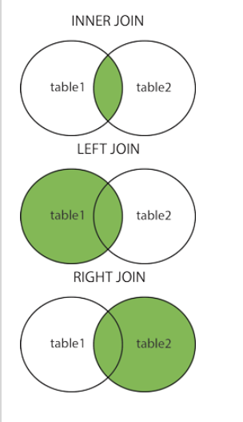

# MySQL

一、数据库管理系统DBMS
====
### 软件
```markdown
	bin
	config
	db	（保存数据）
		- admin
		  - 123adsk.txt{username,password,class...}
		  - dndsjnd.txt{username,password,class...}
		- course
		- school
	src
```


### 写程序：

		a. 数据库在本地
			1.找到目录
			2.添加数据
		b. 数据库在远程
			1.socket 连接上远程机器
			2.socket 发送（命令）# add|123asdk
		c. 做些什么？？？

#### a. 程序

	程序，socket客户端

#### b. 数据

	socket服务端

#### c. 制作一套规则

		add|123asdk
		delete|123asdk
		...

#### d. socket客户端和服务端用户认证,授权，限制

-- SQLserver（收费）

`Oracle，sqlite，access。。。`

`MySQL，SqlServer，Oracle，sqlite，access。。。`

##### 服务端和客户端

mysql：

		add|asdf
SQLServer：

		a|asdf

二、下载安装：
======
`1.下载`

[MySQL 5.7.26 Portable ZIP](https://cdn.mysql.com//Downloads/MySQL-5.7/mysql-5.7.26-winx64.zip)

*MySQL 5.7以后的Windows版本没有my.ini配置文件，可在解压后的根文件夹里自行新建。*

*配置文件如下仅供参考，可自行按需修改*

```config

[client]
port=3306
default-character-set=utf8

[mysqld]
basedir=$mysql$
datadir=$mysql$/data
port=3306
character-set-server=utf8
default-storage-engine=INNODB
max_connections=20

[mysql]
default-character-set=utf8
```

`2.解压到任意目录`

`3.服务器端运行起来`
		

		mysqld
`4.客户端连接`

省事：
----
* 将mysqld制作成Windows服务 （`mysqld.exe --install`）

```shell

	net start mysql
	net stop mysql
```
* 打开服务管理，直接...

三、MySQL数据库
===

1. 概念

		数据库，文件夹
		数据库表，文件
		数据行，文件中的一行数据
2. 使用
```shell	
	启动服务器：
		net start mysql
		或
		D:\Program Files\......\mysql\bin\mysqld
	
	service mysql start
	
	/etc/init.d/mysql start
	
	客户端：
		mysql -u root -p
```

初试：

```sql
	show databases; 							# 查看当前MySQL都有哪些数据，根目录都有哪些文件夹
	create database 数据库名;					# 创建文件夹
	use 数据库名;								# 使用选中数据库，进入目录
	show tables;								# 查看当前数据库下都有哪些数据表
	create table 表名(nid int,name varchar(20),pwd varchar(64)); # 创建数据表
	select * from 表名;							# 查看表中的所有数据
	insert into 表名(nid,name,pwd) value(12,'xiaoming','123'); # 插入数据

```

**注意：sql语句结尾一定要加;(英文格式的分号)**

3. 用户授权

	用户管理特殊命令：
```sql	
	创建用户
		create user 用户名@IP地址 identified by '密码';
	创建用户并分配与root相同的权限
	    grant all on *.* to admin@'%' identified by 'admin' with grant option;
	删除用户
		drop user 用户名@IP地址;
	修改用户
		rename user 用户名@IP地址; to 新用户名@IP地址;
	修改密码
		set password for 用户名@IP地址 = Password('新密码');
		update user set password = password('新密码');               // 适用于mysql 5.5版
		update user set authentication_string = password('新密码');  // 适用于mysql 5.7及后续版本
		flush privileges;                                            // 改完密码一定要刷新
		
	select password('123456');		// 查看加密后的密文
```
***PS：用户权限相关数据保存在mysql数据库的user表中，所以也可以直接对其进行操作（不建议）***

	权限管理特殊命令：
```sql

	show grants for '用户'@'IP地址';                    -- 查看权限
	grant  权限 on 数据库.表 to   '用户'@'IP地址';      -- 授权
	revoke 权限 on 数据库.表 from '用户'@'IP地址';      -- 取消权限
	flush privileges;                                   -- 刷新权限
	
	grant all privileges on *.* to xiaoming identified by '123456' with  grant option; 指定密码是123456的xiaoming的权限（为了防止有多个用户名叫xiaoming的用户）	
```
**with  grant option 是将grant权限也赋给某人**

	对于权限：
```sql
	all privileges  除grant外的所有权限 (privileges 可以尝试省略)
		select          仅查权限
		select,insert   查和插入权限
		...
		usage                   无访问权限
		alter                   使用alter table
		alter routine           使用alter procedure和drop procedure
		create                  使用create table
		create routine          使用create procedure
		create temporary tables 使用create temporary tables
		create user             使用create user、drop user、rename user和revoke  all privileges
		create view             使用create view
		delete                  使用delete
		drop                    使用drop table
		execute                 使用call和存储过程
		file                    使用select into outfile 和 load data infile
		grant option            使用grant 和 revoke
		index                   使用index
		insert                  使用insert
		lock tables             使用lock table
		process                 使用show full processlist
		select                  使用select
		show databases          使用show databases
		show view               使用show view
		update                  使用update
		reload                  使用flush
		shutdown                使用mysqladmin shutdown(关闭MySQL)
		super                   使用change master、kill、logs、purge、master和set global。还允许mysqladmin调试登陆
		replication client      服务器位置的访问
		replication slave       由复制从属使用
```
	对于目标数据库以及内部其他：
```sql
	数据库名.*           数据库中的所有
	数据库名.表          指定数据库中的某张表
	数据库名.存储过程    指定数据库中的存储过程
	*.*                  所有数据库
```

	对于用户和IP：
```sql			
	用户名@IP地址        用户只能在改IP下才能访问
	用户名@192.168.1.%   用户只能在改IP段下才能访问(通配符%表示任意)
	用户名@%             用户可以再任意IP下访问(默认IP地址为%)
```


四.SQL语句
====

**SQL语句的划分**

1. DDL(Data Defined Language)

	`数据定义语言 包括create,alter,drop操作，如数据库中创建数据对象，修改数据对象，删除数据对象。`
2. DML(Data Manipulation Language)

	`数据操作语言 包括对数据库的insert,update,delete操作`
3. DQL(Data Query Language)

	`数据查询语言 包括对数据库的select操作，用于获取表中的数据，包括where,group by,having,order by, left/right/inner (outer) join on 的自连接，子连接等。`
4. DCL(Data Control Language)

	`数据控制语言 包括grant，revoke，deny 操作，一般设置相关数据库对象访问权限`
	

**事务控制语言(TCL)关于数据完整性一致性的**
	
## 数据库级别

 查询数据库：

```sql
	SHOW DATABASES;

	SHOW DATABASES LIKE '%yu%' // 过滤显示 只显示含有关键词的

	SHOW DATABASES LIKE 'yu%'	// 过滤显示 只显示含有首部部有关键词的

	SHOW DATABASES LIKE '%yu'	// 过滤显示 只显示含有尾部有关键词的

	select  database( );	// 获取自己目前所在的数据库
```

 创建数据库：

```sql
	CREATE DATABASE 数据库名;
	CREATE DATABASE 数据库名 DEFAULT CHARSET utf8 COLLATE utf8_general_ci
	CREATE DATABASE 数据库名 DEFAULT CHARSET gbk COLLATE gbk_chinese_ci
	use 数据库名;
	drop 数据库名;
	ALTER DATABASE DEFAULT CHARSET utf8 COLLATE utf8_general_ci;
```

## 表级别
```sql

	show tables;                                       // 查看表名和视图名
	show create table student2;                        // 查看创建语句

	desc 数据表名;

	create table  表名(nid int, name varchar(60))
	
	// 复制表结构
	create table 新表名 select * from 旧表名 where 1=2; // 复制表结构，不包括主键和自增
	create table 新表名 like 旧表名;                    // 复制表结构，包括主键和自增
	
	// 复制表结构和表数据
	creat table 新表名 select * form 旧表名;            // 复制整个表结构和表数据到新表        
	
	// 复制表数据
	insert into 新表名 select * from 旧表名;            // 复制整个表数据到新表，前提表结构要一致，但字段名可以不同
	insert into 新表名(字段1,字段2) select 字段1,字段2 from 旧表名;      // 复制指定的部分表数据到新表，指定的字段的数据类型和字段数量要对应一致，字段名可以不同
	
	rename table 原数据库名 to 新数据库名;			  // 修改数据表名 方法一	
	alter table 原数据库名 remove 新数据库名;			  // 修改数据表名 方法二
	
	alter table 表名 modify 字段名 数据类型;			  // 修改字段的类型
	alter table 表名 add 字段名 数据类型;			  // 给表添加一个字段
	alter table 表名 add 字段名 数据类型 after 字段一名;	// 给表添加一个字段在字段一后
	
	alter table 表名 drop 字段名;					 // 删除字段
	alter table 表名 change 旧列名 新列名 新类型;		 // 修改列名
	
	// 清空表
	delete from 表名;								// 只会清空表数据，自增不会归零
	truncate table 表名;							// 会清空表结构和表数据，即自增归零
	
	show variables like 'char%';					// 查看数据类型的编码方式
	
	set names gbk;								   // 设置编码方式
```

### 约束

```markdown
	a.默认值
	
	b.是否可以为空
	
	c.自增列（一张表只能有一个，数字，必须是索引-主键（主键索引））
	
	d.主键索引：
	一张表只能有一个主键唯一不能重复，不能为null，一般情况下，自增列设置主键
		唯一索引：unique
		nid int not null unique,

			可以为null，一张表可以有多个唯一列
		1,2,3,4,5,6,null
	
	-- 约束
	-- 索引，加速查找
	
	e.外键foreign key,一对多
		两张表建立约束

		--约束
		--foreign key,一对多

	f.数据类型：数值 、时间和字符串
```

```sql
	create table xxx(
		nid ... primary key,
		...
	)
	
	create table student(
		name varchar(10) not null,
		num int not null,
		age int,
		gender int,
		primary key (name, num)
	)	
```
- 非空约束：
    `not null`
    	

		name num age
		 a   88   9
		 a   99   9
		 
		 a   88   0		# 不符合

- 主键:

```markdown

	不能为null，
	不能重复，
	一张表只有一个主键（可以多列组成主键）
```

一般用法：

`nid int auto_increment primary key,`

```sql

create table tb5(
	nid int not null auto_increment primary key,
	name varchar(16),
	age int default 19
)engine=innodb default charset=utf8;
```

- 添加外键：

```sql
alter table userinfo add constraint fk_u_p foreign key userinfo(part_id) references part(nid);
```
```sql

	drop table 表名;		# 直接删除表 (表结构也会删除) 不支持事务，不能回滚数据

	delete from 表名;		# 速度慢，清空表内容 (表结构不删除)，自增不会回到原点，支持事务，可以回滚

	truncate table 表名;	# 速度快，清空表内容 (表结构删除和重建)，自增回到原点，不支持事务，不能回滚

	select * from 表名;
```

-------------------------------------------------------------------------

### 数值：
```markdown

		bit 二进制
		tinyint
		smallint
		int
		bigint
```


#### bit[(M)]
	二进制位（101001），m表示二进制位的长度（1-64），默认m＝1


​	
#### tinyint[(m)] [unsigned] [zerofill]


```markdown
	小整数，数据类型用于保存一些范围的整数数值范围：
	
	有符号：
	
		-128 ～ 127

	无符号：

		0 ～ 255
```

**特别的： MySQL中无布尔值，使用tinyint(1)构造。**

#### int[(m)][unsigned][zerofill]

	整数，数据类型用于保存一些范围的整数数值范围：
	
		有符号：-2147483648 ～ 2147483647
	
		无符号：0 ～ 4294967295

**特别的：整数类型中的m仅用于显示，对存储范围无限制。例如： int(5),当插入数据2时，select 时数据显示为： 00002**

#### bigint[(m)][unsigned][zerofill]
	大整数，数据类型用于保存一些范围的整数数值范围：
	
		有符号：
	
					-9223372036854775808 ～ 9223372036854775807
		无符号：
	
					0  ～  18446744073709551615

#### decimal[(m[,d])] [unsigned] [zerofill]

	准确的小数值，m是数字总个数（负号不算），d是小数点后个数。 m最大值为65，d最大值为30。

*存储时超出规定范围，会在规定小数位数那里四舍五入来存储*

**特别的：**

**对于精确数值计算时需要用此类型**

**decaimal能够存储精确值的原因在于其内部按照字符串存储。**

#### FLOAT[(M,D)] [UNSIGNED] [ZEROFILL]

*存储时超出规定范围，会在规定小数位数那里截断来存储*

	单精度浮点数（非准确小数值），m是数字总个数，d是小数点后个数。
	
	无符号：

```markdown

	-3.402823466E+38 to -1.175494351E-38,

	0

	1.175494351E-38 to 3.402823466E+38
```

	有符号：
```markdown

	0

	1.175494351E-38 to 3.402823466E+38
```


**数值越大，越不准确**

#### DOUBLE[(M,D)] [UNSIGNED] [ZEROFILL]
	双精度浮点数（非准确小数值），m是数字总个数，d是小数点后个数。

无符号：

```markdown

	-1.7976931348623157E+308 to -2.2250738585072014E-308

	0

	2.2250738585072014E-308 to 1.7976931348623157E+308
```

有符号：

```markdown

	0

	2.2250738585072014E-308 to 1.7976931348623157E+308
```

**数值越大，越不准确**

### 字符串

#### 定长
#### char (m)
	char数据类型用于表示固定长度的字符串，可以包含最多达255个字符。其中m代表字符串的长度。

**PS: 即使数据小于m长度，也会占用m长度**
```sql

	create table tb13(n char(7),b int,c int)
	insert ssss
```
	查找速度快，浪费空间

#### 变长
#### varchar(m)
	varchars数据类型用于变长的字符串，可以包含最多达255个字符。其中m代表该数据类型所允许保存的字符串的最大长度，只要长度小于该最大值的字符串都可以被保存在该数据类型中。
```sql

	create table tb13(n varchar(7),b int,c int)
	insert ssss
	insert sssssss
	insert sssssssss
```
	查找速度慢，节省空间

**注：**

**虽然varchar使用起来较为灵活，但是从整个系统的性能角度来说，char数据类型的处理速度更快，有时甚至可以超出varchar处理速度的50%。因此，用户在设计数据库时应当综合考虑各方面的因素，以求达到最佳的平衡**


### enum
	枚举类型（单选）
		An ENUM column can have a maximum of 65,535 distinct elements. (The practical limit is less than 3000.)
**示例：**

```sql

	CREATE TABLE shirts (
		name VARCHAR(40),
		size ENUM('x-small', 'small', 'medium', 'large', 'x-large')
	);
	INSERT INTO shirts (name, size) VALUES ('dress shirt','large'), ('t-shirt','medium'),('polo shirt','small');
```


### set

	集合类型（多选）
	
		A SET column can have a maximum of 64 distinct members.

**示例：**

```sql

	CREATE TABLE myset (col SET('a', 'b', 'c', 'd'));
	INSERT INTO myset (col) VALUES ('a,d'), ('d,a'), ('a,d,a'), ('a,d,d'), ('d,a,d');
```

### 二进制数据：
```markdown

	TinyBlob、Blob、MediumBlob、LongBlob
```

```markdown

	* 上传数据
	* Blob，强制二进制方式
	* varchar(65), “D:\home.avi”将上传的文件保存在硬盘，D:\home.avi
```

### 文本

#### text
	text数据类型用于保存变长的大字符串，可以组多到65535 (2**16 − 1)个字符。

#### mediumtext
	A TEXT column with a maximum length of 16,777,215 (2**24 − 1) characters.

#### longtext
	A TEXT column with a maximum length of 4,294,967,295 or 4GB (2**32 − 1) characters.

### DATE

```sql

	YYYY-MM-DD（1000-01-01/9999-12-31）
```

### 日期时间

#### TIME

```sql

	HH:MM:SS（'-838:59:59'/'838:59:59'）
```

#### YEAR

```sql

	YYYY（1901/2155）
```

#### DATETIME

```sql

	YYYY-MM-DD HH:MM:SS（1000-01-01 00:00:00/9999-12-31 23:59:59）
```

#### TIMESTAMP

```sql

	YYYYMMDD HHMMSS（1970-01-01 00:00:00/2038-01-19 11:14:07(2037 年某时)）
```
-------------------------------------------------------------------------

## 函数

插入 insert('helloworld',1,2,'abcd') // 从下标1开始

-------------------------------------------------------------------------

## 数据行级别

```sql

	select * from 表名;

	添加列：alter table 表名 add 列名 类型
	删除列：alter table 表名 drop column 列名
	修改列：
			alter table 表名 modify column 列名 类型;  -- 类型
			alter table 表名 change 原列名 新列名 类型; -- 列名，类型
	  
	添加主键：
			alter table 表名 add primary key(列名);
	删除主键：
			alter table 表名 drop primary key;
			alter table 表名  modify  列名 int, drop primary key;
	  
	添加外键：alter table 从表 add constraint 外键名称（形如：FK_从表_主表） foreign key 从表(外键字段) references 主表(主键字段);
	删除外键：alter table 表名 drop foreign key 外键名称
	  
	修改默认值：ALTER TABLE testalter_tbl ALTER i SET DEFAULT 1000;
	删除默认值：ALTER TABLE testalter_tbl ALTER i DROP DEFAULT;
```
##### 1.增

```sql

	insert into tb1(name,age) values('alex',18);
	insert into tb2(name,age) values('alex',18),('eric',19),('got',20);

	create table tb6(
		nid int not null auto_increment primary key,
		name varchar(20),
		age int
	)engine=innodb default charset=utf8;

	create table tb7(
		nid int not null auto_increment primary key,
		caption varchar(20),
		gender varchar(20)
	)engine=innodb default charset=utf8;

	insert into tb7(caption,gender)values('kakap','1'),('hu','2'),('fafa','2')

	insert into tb6(name,age)select caption,gender from tb7;		# 将tb7中选中的数据插入到tb6中的指定位置（前提类型对应得能转换）

	insert into tb6(name,age)select caption,caption from tb7;		# 会报错。。原因：类型不一致，且无法转换

	insert into tb6(name,age)select caption,nid from tb7;

	insert into tb6(name,age)select caption,gender from tb7 where nid>2;
```

##### 2.删

```sql

	delete from tb7 where nid=1;
	delete from tb7 where name='kakap'
	delete from tb7 where name='kakap' and nid=5;
	delete from tb7 where name='kakap' or nid=1;
	delete from tb7 where nid<2;
```

##### 3.改

```sql

	update tb7 set age=1;
	update tb7 set age=2 where nid=10;
	update tb7 set age=12,name='opoo' where nid >12;
```

##### 4.查

```sql

	select * from tb7;
	select * from tb7 where nid>=2;
	select * from tb7 where nid<=5 name='hu';
	select name,age,nid from where nid<=3;
```
**PS:尽量不要用select * from ... 因为它效率低，要想查询全部项，可以吧每一项名称列出来。。。**


##### 其他

```markdown
a. 条件
    select * from 表 where id > 1 and name != 'alex' and num = 12;
 
    select * from 表 where id between 5 and 16;
 
    select * from 表 where id in (11,22,33)
    select * from 表 where id not in (11,22,33)
    select * from 表 where id in (select nid from 表)
```
**注意：where里不能使用聚合函数(如max(),min(),avg(),count()等**
```sql
 b. 通配符
    select * from 表 where name like 'ale%'  - ale开头的所有（多个字符串）
    select * from 表 where name like 'ale_'  - ale开头的所有（一个字符）
 
c. 限制
    select * from 表 limit 5;            - 前5行
    select * from 表 limit 4,5;          - 从第4行开始的5行
    select * from 表 limit 5 offset 4    - 从第4行开始的5行	***推荐用***
```
**翻页**

```markdown

	页码：pageNo   
	页面容量：pageSize
	总记录数: cnt
	到数据库中取 哪些数据limit (pageNo-1)*pageSize ,pageSize; 
	总页数  totalpage = (cnt%pageSize==0)?(cnt/pageSize):(cnt/pageSize+1);   =尾页 
 
d. 排序
    select * from 表 order by 列 asc              - 根据 “列” 从小到大排列
    select * from 表 order by 列 desc             - 根据 “列” 从大到小排列
    select * from 表 order by 列1 desc,列2 asc    - 根据 “列1” 从大到小排列，如果相同则按列2从小到大排序
 
e. 分组
    select num from 表 group by num
    select num,nid from 表 group by num,nid
    select num,nid from 表  where nid > 10 group by num,nid order nid desc
    select num,nid,count(*),sum(num),max(num),min(num),agv(num) from 表 group by num,nid
 
    select num from 表 group by num having max(id) > 10
	select num as a,count(nid) as b from group by part			//as 可以省略
 
```
**特别的：group by必须在where之后，order by之前**
```sql

	group by + group_concat()
	group_concat(字段名)可以作为一个输出字段来使用，表示分组之后，根据分组结果，使用group_concat()来放置每一组的某字段的值的集合
	
	典例：	
	select sex from employee group by sex;
	+------+
	| sex  |
	+------+
	| 女   |
	| 男   |
	+------+

	select sex,group_concat(name) from employee group by sex;
	+------+--------------------+
	| sex  | group_concat(name) |
	+------+--------------------+
	| 女   | 李四               |
	| 男   | 张三,王五,Aric     |
	+------+--------------------+

	select sex,group_concat(d_id) from employee group by sex;
	+------+--------------------+
	| sex  | group_concat(d_id) |
	+------+--------------------+
	| 女   | 1002               |
	| 男   | 1001,1003,1004     |
	+------+--------------------+
	

f. 连表

    无对应关系则不显示
    select A.num, A.name, B.name
    from A,B
    WHERE A.nid = B.nid
```

 ```sql
     无对应关系则不显示
    select A.num, A.name, B.name
    from A INNER JOIN B			# 对Right数据进行过滤，去除掉NULL
    ON A.nid = B.nid
 
    A表所有显示，如果B中无对应关系，则值为null
    select A.num, A.name, B.name		***###优先用
    from A LEFT JOIN B
    ON A.nid = B.nid
	
    select A.num, A.name, B.name
    from A LEFT OUTER JOIN B			# 对LEFT数据进行过滤，去除掉NULL
    ON A.nid = B.nid
 
    B表所有显示，如果B中无对应关系，则值为null
    select A.num, A.name, B.name
    from A RIGHT JOIN B
    ON A.nid = B.nid
	
	* 自连接
	select A.id B.t_id from self 'A' left join self 'B' on A.tid = B.id;
 
g. 组合
    组合，自动处理重合
    select nickname
    from A
    union
    select name
    from B
 
    组合，不处理重合
    select nickname
    from A
    union all
    select name
    from B
	
	条件：
		> < = >= != <=
		in (1,2,3,4)
		not in (...)
		in (select nid from tb1)
		
---------------------------------------
	select t.name,t.sex
	from stu t
	union
	select c.teacher,c.cname
	from class c;
	
	+-----------+----------+
	| name      | sex      |
	+-----------+----------+
	| 李四      | 男       |
	| 田七      | 女       |
	| 赵六      | 男       |
	| 陈老师    | 1902Java |
	| 李老师    | 1903Java |
	| 吴老师    | 1904Java |
	| 于老师    | 1902UI   |
	| 方老师    | 1901C++  |
	+-----------+----------+
	8 rows in set (0.00 sec)
--------------------------------------

h. 列转行
	SELECT
		student_id AS SID,
		MAX( CASE course_id WHEN 1 THEN num ELSE 0 END ) AS 物理 
	FROM
		score 
	GROUP BY
		student_id;
		
	SELECT 
		user,
		MAX(CASE course_id WHEN "数学" THEN score ELSE 0 END) as '数学'


i. 行转列
    select user,'语文' AS course , cn_score AS score from test
    union
    select user,'数学' AS course, math_score AS score from test
    union
    select user,'英语' AS course, en_score AS score from test
    order by user,course;
 ```


##### 会话

```sql
设置会话变量有三种：
set session var_name = value;
set @@session.var_name = value;
set var_name = value;
查看一个会话变量也有如下三种方式：
select @@var_name;
select @@session.var_name;
show session variables like '%var%';
查看系统中所有的会话变量
show session variables;
```

## 事务

> 事务是一个最小的不可再分的工作单元
> 一个事务对应一个完整业务(如：银行账户转账业务)

#### ACID特性

* 原子性(atomic) 
* 一致性(consistency)
* 隔离性(isolation)
* 持久性(durability)

1. 事务 - 长期有效

```markdown

	// 将自动提交改成手动提交，对多次操作有效，只要没执行set autocommit = 1，当前数据库数据的提交状态始终是手动提交
	set autocommit = 0;  // 关闭自动提交，设置手动提交
	savepoint 回滚点名;  // 设置回滚点
	commit               // 提交剩余正确的事务
	rollback to 回滚点名 // 回滚到指定回滚点
	set autocommit = 1;  // 开启自动提交，取消手动提交,同时做了一个commit操作
```
**注意：回滚仅能撤销未commit的操作，在commit之前设置的回滚点会失效**

2. 事务 - 仅对单次事务有效
```markdown

	start transaction    // 开启事务
	rollback             // 回滚事务
	commit               // 提交事务

```
**start transaction 开启事务后，变成手动提交，在遇到rollback或commit后就自动关闭了事务，变回自动提交**

**脏读**


五、数据库管理
====

### 运用Navicat管理数据库

```markdown

	连接数据库
	-- 查找
	-- 修改
	-- 更新
	...
```
### 数据库备份与恢复
```sql

	导出数据库：
		未登录状态下：
			mysqldump -u用户名 -p密码 数据库名称 >导出文件路径           # 结构+数据
			mysqldump -u用户名 -p密码 -d 数据库名称 >导出文件路径        # 结构 

	导入数据库:
		未登录状态下：
			mysqldump -uroot -p密码  数据库名称 <文件路径
		登录状态下：
			source 文件路径
		
	补充
		- avg()获取平均值
			select student 
	
```
作业：

```sql

3	mysql> select student_id,avg(num) from score group by student_id having avg(num)>60;
	+------------+----------+
	| student_id | avg(num) |
	+------------+----------+
	|          3 |  82.2500 |
	|          4 |  64.2500 |
	|          5 |  64.2500 |
	|          6 |  69.0000 |
	|          7 |  66.0000 |
	|          8 |  66.0000 |
	|          9 |  67.0000 |
	|         10 |  74.2500 |
	|         11 |  74.2500 |
	|         12 |  74.2500 |
	|         13 |  87.0000 |
	+------------+----------+
	11 rows in set (0.00 sec)

4	mysql> select student.sid,student.sname,sum(course_id),sum(num) from score
		-> left outer join student on student.sid=score.student_id
		-> group by student_id;
	+------+-------+----------------+----------+
	| sid  | sname | sum(course_id) | sum(num) |
	+------+-------+----------------+----------+
	|    1 | 理解  |              7 |       85 |
	|    2 | 钢蛋  |              8 |      175 |
	|    3 | 张三  |             10 |      329 |
	|    4 | 张一  |             10 |      257 |
	|    5 | 张二  |             10 |      257 |
	|    6 | 张四  |             10 |      276 |
	|    7 | 铁锤  |             10 |      264 |
	|    8 | 李三  |             10 |      264 |
	|    9 | 李一  |             10 |      268 |
	|   10 | 李二  |             10 |      297 |
	|   11 | 李四  |             10 |      297 |
	|   12 | 如花  |             10 |      297 |
	|   13 | 刘三  |              3 |       87 |
	+------+-------+----------------+----------+
	13 rows in set (0.00 sec)
	
5	mysql> select count(tname) as num from teacher where tname like '李%';
	+-----+
	| num |
	+-----+
	|   2 |
	+-----+
	1 row in set (0.00 sec)
	
6	

	
7	mysql> select * from (
		-> select score.student_id as stid,
		-> student.sname as stname
		-> from
		-> score
		-> left outer join
		-> student on
		-> score.student_id=student.sid
		-> where score.course_id=1 or score.course_id=2
		-> ) as v
		-> group by stid
		-> having count(stid)=2;
	+------+--------+
	| stid | stname |
	+------+--------+
	|    1 | 理解   |
	|    3 | 张三   |
	|    4 | 张一   |
	|    5 | 张二   |
	|    6 | 张四   |
	|    7 | 铁锤   |
	|    8 | 李三   |
	|    9 | 李一   |
	|   10 | 李二   |
	|   11 | 李四   |
	|   12 | 如花   |
	+------+--------+
	
8	SELECT
	student_id,
	student.sname
	FROM
	(
	SELECT
		score.student_id AS student_id,
		teacher.tname AS tname,
		course.cname AS cname
	FROM
		course
		LEFT OUTER JOIN teacher ON teacher.tid = course.teacher_id
		LEFT OUTER JOIN score ON score.course_id = course.cid
	) AS tb
	LEFT OUTER JOIN
	student ON
	student.sid=tb.student_id
	WHERE tb.tname = '李平老师'
	GROUP BY tb.student_id;

	
	SELECT
		student_id AS SID,
		( SELECT num FROM score AS InnerTb WHERE InnerTb.student_id = OuterTb.student_id AND course_id = 1 ) AS 生物,
		( SELECT num FROM score AS InnerTb WHERE InnerTb.student_id = OuterTb.student_id AND course_id = 2 ) AS 物理,
		( SELECT num FROM score AS InnerTb WHERE InnerTb.student_id = OuterTb.student_id AND course_id = 3 ) AS 体育,
		( SELECT num FROM score AS InnerTb WHERE InnerTb.student_id = OuterTb.student_id AND course_id = 4 ) AS 美术,
		sum( OuterTb.num ) AS Sum,
		avg( OuterTb.num ) AS Avg 
	FROM
		score AS OuterTb 
	GROUP BY
		student_id 
	ORDER BY
		Avg ASC;

18 
	SELECT
	course_id,
	MAX(num) as Max,
	MIN(num) as Min
	from score
	GROUP BY
	course_id;
	
19
	select
	student_id,

20
	SELECT
	course.cname,
	teacher.tname,
	AVG(score.num) as Avg
	FROM
	course
	LEFT OUTER JOIN teacher ON teacher.tid=course.teacher_id
	LEFT OUTER JOIN score ON score.course_id=course.cid
	GROUP BY course.cid
	ORDER BY Avg DESC;
	
21
	SELECT
	score.student_id,
	MAX(CASE course.cid
		WHEN 1 THEN
			score.num
		ELSE
			0
	END
	) AS 物理
	FROM
	score
	LEFT OUTER JOIN course ON course.cid=score.course_id
	GROUP BY student_id
	ORDER BY 物理 DESC
	LIMIT 3;
	
22
	SELECT
		course.cname AS 课程名称,
		COUNT( 2 ) AS 人数 
	FROM
		score
		LEFT OUTER JOIN course ON score.course_id = course.cid 
	GROUP BY
		course_id;
		
23
	SELECT
		score.student_id,
		student.sname,
		COUNT(course_id)
	FROM
		score
		LEFT JOIN student ON score.student_id = student.sid 
	GROUP BY
		student_id 
	HAVING
		COUNT( course_id ) = 1;

24
	SELECT
		gender,
		COUNT( sid ) AS 人数 
	FROM
		student 
	GROUP BY
		gender;
		
25
	SELECT
		* 
	FROM
		student 
	WHERE
		sname LIKE '李%';

26

		

```

数据库操作：
1、数据库连接写入配置文件：
	用户名、密码、数据库端口、编码
2、数据库每一表(程序中创建一个类)


六、数据库高级应用
====

## 视图

视图的优点：保护基本表的数据。

视图的特点：
* 视图的数据来源于基本表，对视图的数据进行添加、删除直接影响基本表。
* 视图的列可以来自不同的表，是表的抽象和逻辑意义上建立的。
* 视图的建立和删除不影响基本表。
* 当时图来自多个基本表时,不允许添加和删除数据,但可以修改。

```sql
	
	创建视图
	create view 视图名 as 查询表
	例如：
		create view v_product as select t_id,t_name from t_product; 
		 
	删除视图
	drop view 视图名1,视图名2,视图名3;
	drop view if exists 视图名1,视图名2,视图名3;
	
	修改视图
	create or replace view 视图名 a select t_id,t_name from t_product;    // 方式一
	alter view v_product as select t_id,t_name from t_product;            // 方式二
	
	显示视图信息
	show table status from 数据库名;                      // 查看该数据库视图的状态
	show table status from 数据库名\G;                    // 查看该数据库视图的状态，分行显示
	show table status from 数据库名 like 'v_stu';         // 查看该数据库指定的视图的状态
	show table status from 数据库名\G like 'v_stu';       // 查看该数据库指定的视图的状态，分行显示
	
	use information_schema;
	select * from views\G where table_name='v_%';                                 // 查看所有数据库下的所有视图信息
	
	
	

```

## 索引

### 索引种类

*索引列顺序：*让选择性最强的索引列放在前面。

**索引的选择性**是指：不重复的索引值和记录总数的比值。最大为1

```sql

	show index from 表名\G           // 查询索引
```
* 数据量大
* 经常查询

```text

	普通索引 - 加速查找
	唯一索引 - 加速查找，约束列数据不能重复，null
	主键索引 - 加速查找，约束列数据不能重复，不能为null
	组合索引 - 多列可以创建一个索引文件
```
1. 普通索引

```sql

	create index @indexname on @tablename(@columnname); --新建索引

	// 创建索引的关键词:index/key
	create table tb111(
		sid int not null auto_increment primary key,
		name varchar(32) not null,
		email varchar(64) not null,
		extra text,
		index/key ix_name (name),
		unique ix_name (name,email)  -- 唯一索引(联合唯一索引)
	);

	or

	create table in1(
		sid int not null auto_increment primary key,
		name varchar(32) not null,
		email varchar(64) not null
		);
	create index ix_name on tb111(name);	-- 新建索引

	drop ix_name on tb111;		-- 删除索引

	show index from tb111;	-- 显示索引
	
	
```
*创建索引如果没有指定索引名，那么默认是和列名一样*

2. 唯一索引

```sql

	create unique index uni_index on tb111(name);                       // 方式一
	
	create table tb111(
		sid int not null auto_increment primary key,
		name varchar(32) not null,
		email varchar(64) not null,
		extra text,,
		unique ix_name (name,email)  -- 唯一索引(联合唯一索引)          // 方式二
	)engine=INNODB default charset=utf8;
	
	create table tb111(
		sid int not null auto_increment primary key,
		name varchar(32) not null,
		email varchar(64) not null,
		extra text,
		unique index/key (name)  -- 唯一索引                            // 方式三
	)engine=INNODB default charset=utf8;
	
	alter table @tablename add unique index uni_index tb111(name);      // 方式四
	
	create table tb111(
		sid int not null auto_increment primary key,
		name varchar(32) not null unique,                               // 方式五
		email varchar(64) not null,
		extra text，
	)engine=INNODB default charset=utf8;
	
	drop unique index 索引名 on 表名		// 删除索引
```
3. 主键索引

```sql
    //  创建表 + 创建主键
    create table in1(
        nid int not null auto_increment primary key,
        name varchar(32) not null,
        email varchar(64) not null,
        extra text,
        index ix_name (name)
    )

    OR

    create table in1(
        nid int not null auto_increment,
        name varchar(32) not null,
        email varchar(64) not null,
        extra text,
        primary key(ni1),
        index ix_name (name)
    )
    
	- 不能重复，不能为空
```
```sql

	alter table @tablename add primary key;

	alter table @tablename drop primary key;

	alter table @tablename modify @columnname int drop primary key;

```
4.组合索引

*注:对于同时搜索n个条件时，组合索引的性能好于多个单一索引合并*

```sql
	// 创建索引
	create index ix_name_email on in3(name,email);

	name,pwd
	- 普通组合索引
			无约束
			name,pwd
	- 联合唯一索引
			有约束，两列(多列)数据同时不相同(单个相同不影响)，才能插入，不然报错
	查找：最左匹配
	select * from tb1 where name = 'virualv'
	select * from tb1 where name = 'virualv' and pwd = '123'
	select * from tb1 where pwd = '123'		# 不会走索引
	
	查找：最左匹配
	name,pwd,email
	select * from tb1 where name = 'virualv'
	select * from tb1 where pwd = '123'			# 不会走索引
	select * from tb1 where email = 'virualv'		# 不会走索引
	select * from tb1 where name = 'virualv' and pwd = '123'
```
---

5.覆盖索引

```sql

	select * from tb1 where nid = 1 
	# 先去索引中找
	# 再去数据库中找
	select nid from tb1 where nid < 10
	# 先去索引中找

	-- 只需要在索引表中就能获取到数据时
	-- 这种情况就表示应用上了索引，并且不用去数据库中操作，叫做覆盖索引
```
6.合并索引
```sql

		nid		name(单独索引)		email(单独索引)		pwd
		
		select * from tb where name = 'virualv'
		select * from tb where email = 'virualv666@163.com'
		
		select * from tb where name = 'virualv' or email = 'virualv666@163.com'
		
		nid		name(组)		email(合)		pwd
		#最左前缀
		
		select * from tb where name = 'virualv'
		select * from tb where email = 'virualv666@163.com' ######无法满足最左前缀####### 
		
		select * from tb where name = 'virualv' or email = 'virualv666@163.com'
		
		--> 组合和合并索引的取舍，由业务需求来决定

## 执行计划	-- 相对比较准确的表达出当前SQL运行状况
		是否走索引，不走索引，则直接从数据库中去找
		explain SQL语句
			
		1、explain SQL语句
			type：ALL 	- 全数据表扫描
			type：index	- 全索引表扫描
			
		2、limit
			select * from tb1 where email='virualv666@163.com';
			
			select * from tb1 where email='virualv666@163.com' limit 1;

			--------------SQL:ALL、index,都是有优化的余地--------------

		3、range		
```
7.全文索引

*只能在MyISAM引擎里使用,INNODB不支持*

**设置前文索引的列必须是char,varchar,text 3种类型，其他的类型对应的列，不能加上全文索引**

*待补充*

**至少插入3行样本数据，用于测试的关键词 至少4个字符，不能是停止词：非常频繁出现的常用词，例如:the,some,my,you等 这样过于平常而被认为是不具语义的词，存在一个**

```sql

	create table t3(
		nid int not null,
		name varchar(20),
		sex char(1),
		fulltext index FullTex_inx(name)
	)engine=MyISAM default charset=utf8;
	
	
	
	create table t3(
		nid int not null,
		name varchar(20),
		sex char(1)
	)engine=MyISAM default charset=utf8;
	create fulltext index FullTex_inx t3(name);
	
	select * from t3 where match(name) against (索引词); 
	
	**待处理
	------计算匹配度   

	select  t_person4.*, match(t_info) against ('今天吃了')  from t_person4 \G; 

	 ----测试的关键词出现在所在行中，匹配度就不是0，否则就是0 
	select  t_person4.*, match(t_info) against ('katherine')  from t_person4 \G; 
	**
	
```
8.空间索引

*只有如下字段类型可以建空间索引*

```sql

	// 建立空间索引
	create table t4(
		nid geometry not null,
		name varchar(20) not null,
		age int not null,
		info varchar(255),
		spatial index spat_idx(nid)
	)engine=MyISAM default charset=utf8;
	
	show index from t4\G;
	
	
	drop table if exists t4;
	create table t4(
		nid geometry not null,
		name varchar(20) not null,
		age int not null,
		info varchar(255
	)engine=MyISAM default charset=utf8;
	// 建立空间索引
	alter table t4 add spatial index spat_idx(nid);
```

9.正确使用索引（命中索引）

```sql
	- like '%xx'
		select * from tb1 where name like '%cn';
	- 使用函数
		select * from tb1 where reverse(name) = 'wupeiqi';
	- or
		select * from tb1 where nid = 1 or email = 'seven@live.com';
		特别的：当or条件中有未建立索引的列才失效，以下会走索引
				select * from tb1 where nid = 1 or name = 'seven';
				select * from tb1 where nid = 1 or email = 'seven@live.com' and name = 'alex'
	- 类型不一致
		如果列是字符串类型，传入条件是必须用引号引起来，不然...
		select * from tb1 where name = 999;
	- !=
		select * from tb1 where name != 'alex'
		特别的：如果是主键，则还是会走索引
			select * from tb1 where nid != 123
	- >
		select * from tb1 where name > 'alex'
		特别的：如果是主键或索引是整数类型，则还是会走索引
			select * from tb1 where nid > 123
			select * from tb1 where num > 123
	- order by
		select email from tb1 order by name desc;
		当根据索引排序时候，选择的映射如果不是索引，则不走索引
		特别的：如果对主键排序，则还是走索引：
			select * from tb1 order by nid desc;
	 
	- 组合索引最左前缀
		如果组合索引为：(name,email)
		name and email       -- 使用索引
		name                 -- 使用索引
		email                -- 不使用索引
		
	其他注意事项：
		- 避免使用select *
		- count(1)或count(列) 代替 count(*)
		- 创建表时尽量时 char 代替 varchar
		- 表的字段顺序固定长度的字段优先
		- 组合索引代替多个单列索引（经常使用多个条件查询时）
		- 尽量使用短索引
		- 使用连接（JOIN）来代替子查询(Sub-Queries)
		- 连表时注意条件类型需一致
		- 索引散列值（重复少）不适合建索引，例：性别不适合
```

删除索引

```sql
	
	// 方式一
	drop index 索引名 on 表名;
	
	//方式二
	alter table 表名 drop index 索引名;
	
	alter table 表名 drop primary key;     // 删除主键索引
```


**禁用和启用索引**
```sql

	alter table 表名 enable keys;        // 启用索引

	alter table 表名 disable keys;       // 禁用索引
```
## 索引的优点
- 索引通常远小于数据行的大小，只读取索引能大大减少数据访问量。
- 一些存储引擎（例如 MyISAM）在内存中只缓存索引，而数据依赖于操作系统来缓存。因此，只访问索引可以
- 不使用系统调用（通常比较费时）。
- 对于 InnoDB 引擎，若辅助索引能够覆盖查询，则无需访问主索引。

# 普通索引，数字，num ！=123 ？？？？

# (name,email,pwd) ? email,pwd 是否走索引？
# 如何创建短索引？
*待补充* 

**注意：**

1. 索引是在存储引擎中实现的，也就是说不同的存储引擎会使用不同的索引
2. MyISAM和InnoDB存储引擎：只支持BTREE索引，也就是说默认使用BTREE，不能更换
3. MEMORY/HEAP存储引擎支持HASH和BTREE索引
4. 索引我们分为四类来讲，单列索引（普通索引，唯一索引，主键索引）、组合索引、全文索引、空间索引。

#### mysql 慢日志

## 分页查询

```sql
select * from tb limit (start-1)*pageSize,pageSize
```

limit原理

```sql

每页显示10条：
当前 118 120， 125

倒序：
            大      小
            980    970  7 6  6 5  54  43  32

21 19 98     
下一页：

    select 
        * 
    from 
        tb1 
    where 
        nid < (select nid from (select nid from tb1 where nid < 当前页最小值 order by nid desc limit 每页数据 *【页码-当前页】) A order by A.nid asc limit 1)  
    order by 
        nid desc 
    limit 10;


    select 
        * 
    from 
        tb1 
    where 
        nid < (select nid from (select nid from tb1 where nid < 970  order by nid desc limit 40) A order by A.nid asc limit 1)  
    order by 
        nid desc 
    limit 10;


上一页：

    select 
        * 
    from 
        tb1 
    where 
        nid < (select nid from (select nid from tb1 where nid > 当前页最大值 order by nid asc limit 每页数据 *【当前页-页码】) A order by A.nid asc limit 1)  
    order by 
        nid desc 
    limit 10;


    select 
        * 
    from 
        tb1 
    where 
        nid < (select nid from (select nid from tb1 where nid > 980 order by nid asc limit 20) A order by A.nid desc limit 1)  
    order by 
        nid desc 
    limit 10;
    
```

## 变量

#### 分类

1. 局部变量

`	作用范围在存储过程的语句块内，函数内有效，超出范围不可见`


2. 用户变量
```sql

	@变量名     变量名自取
		set @变量名 = 值1;
		set @变量名 = 值1；
		select 值1 into @变量名;
		select @变量名 := 值1;
		
	作用范围：单次连接期间有效；退出登录，重新登录后获取的值是null
	
```

3. 会话变量
```markdown

	@@变量名 三百多个(mysql 5.5中) 513个(mysql 5.7中) ,变量名固定
		session 变量名固定
		@@session.变量名
	
	作用范围：单次连接期间有效，退出登录，重新登录，恢复成默认值
	
```

4. 全局变量
```markdown

	三百多个(mysql 5.5中) 499个(mysql 5.7中)
	@@global.变量名
	global 变量名固定
	
	作用范围：在服务启动期间有效，如果服务重启，失败，恢复成默认值（退出登录，重新登录，你设置的值仍旧有效，除非  重启服务），服务重启，恢复成默认值。
	
```

## 存储过程

#### 存储过程编写
```sql
	
	// 创建存储过程
	delimiter &&
	create procedure pro_add(in a int,in b int,out result int)
	begin
	declare c int;
	set c = 0;
	set c = a+b;
	set result = c;
	end &&;
	delimiter  ;

	set @ result=0;
	call pro_add(10,13,@result); 
	
	select @result;
	
	// 删除存储过程
	drop procedure if exists pro_add
	
```
## 函数

1. 条件分支语句
```sql

	// 多重if,case分支  既能用于等值判断，又能用于区间判断
	if 条件 then
		语句块;
	elseif 条件2 then
		语句块;
	elseif 条件3 then
		语句块;
	else
		语句块;
	end if;     // 结束语句 （注意不要忘了end if后的分号';'）
	
	// case语法 只能用于等值判断
	case 变量名
	when 值1 then 语句块1;
	when 值2 then 语句块2;
	......
	else 语句块n;
	end case;
	
```
2. 循环语句
```sql

	while语句
	
	leave while/repeat/loop 语句
	
	iterate // 类似于java中的continue
	
	repeat 语句
	
	循环标签 
	
	loop 语句
	
	show function status\G;
	
	或在 information_schema库中的routine_name表 中查
	或在 mysql库中的function表 中查
	
```
#### 自定义函数

## 游标


## 触发器

#### 每个表有如下四种触发器：
```sql

	before insert
	after insert
	before update
	after update
	before delete
	after delete
```

```sql

	// before insert
	delimiter $$
	drop trigger if exists tri_stuInsert;
	create trigger tri_stuInsert before insert on stu
	for each row
	begin
	insert into t_log(t_createDate,eventName) values(now(),'INSERT');
	end $$

	delimiter ;
	
	// after insert
	delimiter $$
	drop trigger if exists tri_stuInsert;
	create trigger tri_stuInsert after insert on stu
	for each row
	begin
		insert into t_log(t_createDate,eventName) values(now(),'Insert');
	end $$
	delimiter ;
	
	
	drop trigger if exists tri_stuInsert;
	
	
	// before update
	delimiter $$
	drop trigger if exists tri_update;
	create trigger tri_update before update on stu
	for each rows
	begin
		insert into t_log(t_createDate,eventName) values(now(),'Update');
	end $$
	delimiter ;
	
	// after update
	delimiter $$
	drop trigger if exists tri_update;
	create trigger tri_update after update on stu
	for each rows
	begin
		insert into t_log(t_createDate,eventName) values(now(),'Update');
	end $$
	delimiter ;
	
	// before delete
	delimiter $$
	drop trigger if exists tri_delete;
	create trigger tri_delete before delete on stu
	for each row
	begin
		insert into t_log(t_createDate,eventName) values(now(),'Delete');
	end $$
	delimiter ;
	
	// after delete
	delimiter $$
	drop trigger if exists tri_delete;
	create trigger tri_delete after delete on stu
	for each row
	begin
		insert into t_log(t_createDate,eventName) values(now(),'Delete');
	end $$
	delimiter ;
	
	// 查询 触发器
	show triggers from 表名\G;
```
---------

部分参考于

* [Page 1](http://www.cnblogs.com/wupeiqi/articles/5713315.html)
* [Page 2](http://www.cnblogs.com/wupeiqi/articles/5713323.html)
